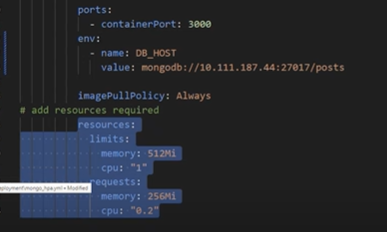

# K8

```bash
kubectl get service # gives information of system
```

1. make dploy.yml file
2. `kubectl create -f <deploy.yml-file>`
3. expose this file by creating service.yml file
4. `kubectl create -f <service.yml-file>`

Adding more pods
1. `kubectl edit deploy name_of_delpoyment`
2. change replicas to desired 
3. save
4. close
5. DONE

## Helpful commands
```bash
kubectl delete deploy nginx-deployment
kubectl delete svc nginx-svc
kubectl edit <deploymentname>
kubectl get all
# Change bindip
# command:
# - "- bind_ip"
# - "0.0.0.0"
```

## Deploying app on K8

1. node-app-deploy.yml script
```yml
---
apiVersion: apps/v1 # which api to use for deployment
kind: Deployment # pod - service what kind of service you wnat

metadata:
  name: node-app-deployment
spec:
  selector: #go into this
    matchLabels: # go into this
      app: nodeapp # look for this label to match with k8
      # Replica set of this with pods
  replicas: 2
  # template to use it's label for k8 service to launch in browser
  template:
    metadata: 
      labels:
        app: nodeapp
    
    spec:
      containers:
      - name: nodeapp
        image: muyisanibaba/nodejs-app
        ports:
        - containerPort: 3000
```
2. node-app-service.yml
```yml
---
# Select type of API and type of service
apiVersion: v1
kind: Service
# Meta data for name
metadata:
  name: nodeapp-svc
  namespace: default # sre
# Spec to include ports selector to connect to the deployment
spec:
  ports:
  - nodePort: 30001 # range is 30000-32768
    port: 3000
    targetPort: 3000

# Lets define the selector and label to connect to nginx deploy
  selector:
    app: nodeapp # this label connects service to deployment
  

  type: NodePort # there is clusterIP Node port and loadbalancer
```
3. `kubectl create -f node-app-deploy.yml`
4. `kubectl create -f node-app-service.yml`
5. check with localhost:30001

