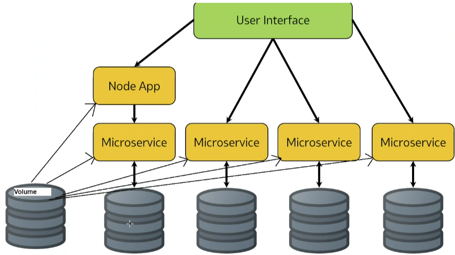
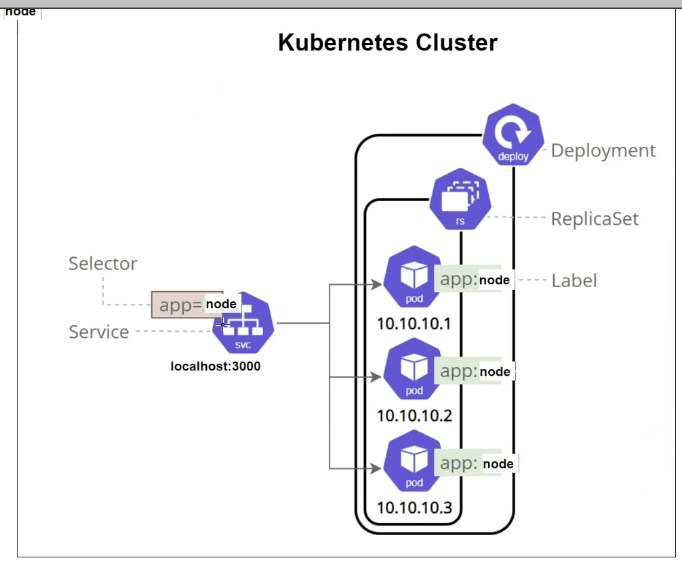
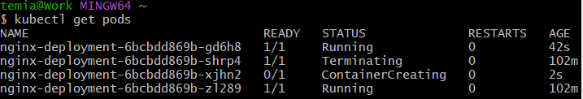
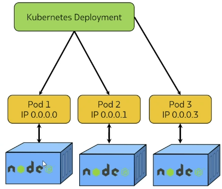

# Microservices architecture with Docker and K8
## Definition
The separation of functions within your deployment into different infrastucture. In this case I containerised node app and mongodb. Anything that has it's own endpoint.<br>

## Why microservices
- Removes dependecies between different parts within the applications (if login screen doesn't work doesn't effect main page)
- Small (as many needed) 
- Scalable (good for changing demands, monolith is for a known demand which doesn't change)
- Works best for large scale deployments
## Why not microservices
- Not easy to manage
- Costs more
- Needs different teams
## Virtualisation vs Containerisation
Virtualization lets you run multiple operating systems on the same physical server, whereas containerization enables you to deploy multiple applications or microservices on the same operating system without any hardware abstraction.
## Docker - building
## Why docker
- Globally available images
- Not as secure
## How docker works
- Uses APIs
- Docker client (our terminal)provides instruction (docker build pull run) to APIs
- Docker host is docker desktop
- Docker hub registry is the remote storage for repositories<br>

## Image vs container
Containers are running images, images are stopped containers. Just like instances and images
## Read Replica

- Makes data persistent
- Prevents people changing data you have put out to the public
## K8 - managing and scaling K8
<br>
Docker doesn't have the capability to scale highly available with no point of faikure.
- Self healing (as soon as one pod is deleted K8 creates a new one, uses labels to know which pod to deploy)<br>

- Scale in and out on demand
- Eliminating single point of failure<br>

https://kubernetes.io/docs/concepts/overview/working-with-objects/labels/<br>
## Labels and selectors
Labels are key/value pairs that are attached to objects such as Pods. Labels can be used to organize and to select subsets of objects. <br>
By using labels, people managing Kubernetes can quickly find and manage specific groups of containers without getting confused by everything else. It makes organizing and running applications much easier!<br>
```bash
app=math-app
env=testing
version=v2
```
Selectors is like a filter to help us see only the items with the labels we are interested in. Selectors help people using Kubernetes to quickly find and manage exactly the containers they need without getting distracted by all the others.<br>
```bash
# 1st container with labels 
app=math-app, env=testing, and version=v2
# 2nd container with labels 
app=math-app, env=production, and version=v1
# 3rd container with labels 
app=game, env=testing, and version=v1
```
Now, if you want to find all containers related to the math app in the testing environment, you would use a selector like this:
```bash
app=math-app
env=testing
```
Using this selector is like putting on glasses that show you only the containers with both app=math-app and env=testing. So, you would see only the first container from our list above.