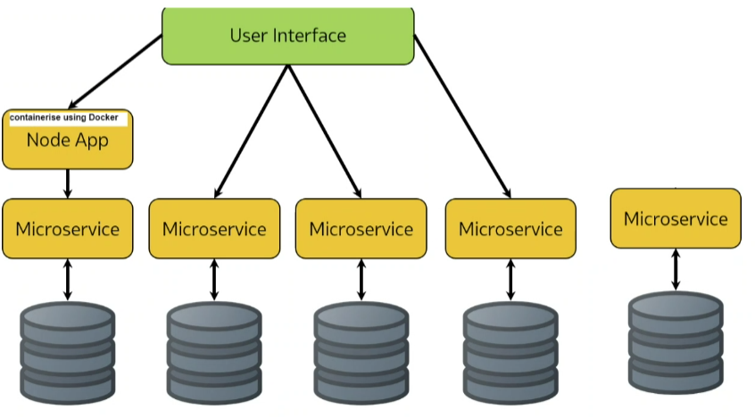
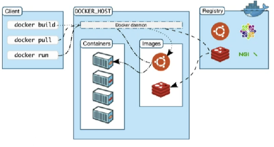

# Microservices architecture with Docker and K8
## Definition
The separation of functions within your deployment into different infrastucture. In this case I containerised node app and mongodb. Anything that has it's own endpoint. 

## Why microservices
- Removes dependecies between different parts within the applications (if login screen doesn't work doesn't effect main page)
- Small (as many needed) 
- Scalable (good for changing demands, monolith is for a known demand which doesn't change)
- Works best for large scale deployments
## Why not
- Not easy to manage
- Costs more
- Needs different teams
## Docker - building
## Why docker
- Globally available images
## how docker works
- Uses APIs
- Docker client (our terminal)provides instruction (docker build pull run) to APIs
- Docker host is docker desktop
- Docker hub registry is the remote storage for repositories 

## image vs container
Containers are running images, images are stopped containers. Just like instances and images
## K8 - managing and scaling K8